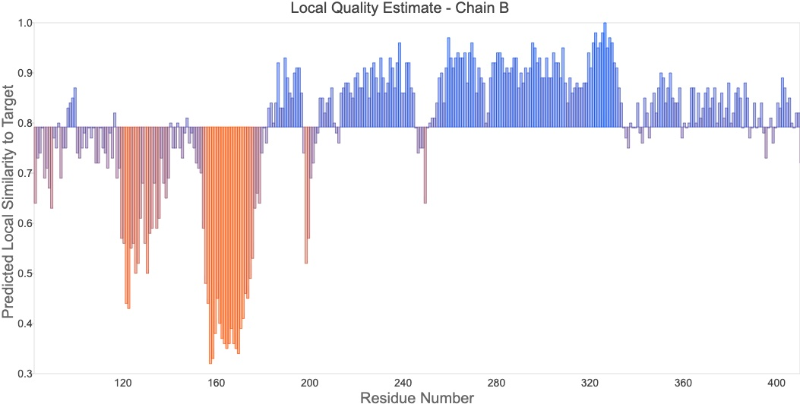
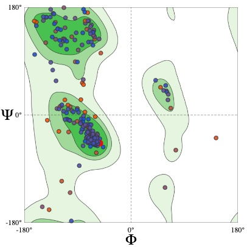

Patrick Kennedy 
BIMM 143: Project 2


Introduction:

Scientific Question:
Because alternative splicing leads to different isoforms for the human retinoic acid receptor-alpha, could these differing isoform Amino Acid sequences lead to an effect on structural differences between retinoic acid recptor alpha isoform-1 and retinoic acid receptor alpha isoform-2?

Scientific Hypothesis:
If there are differences between human retinoic acid receptor-alpha isoforms in their sequence, then we could be expected to see a difference between their structures.

Background: The gene/protein of interest is human retinoic acid receptor-alpha, and this protein is nuclear receptor which serves to regulate transcription in a ligand-dependent manner. The receptor protein interacts with retinoic acid which is a derivative of Vitamin A. It is important to note that in the absence of its ligand, transcription is repressed. In addition, alternatively spliced transcript variants have been found, and will be explored in this project. The two isoforms which will be covered in this project are RARA isoform- 1 and RARA isoform-2. RARA isoform-1 is known to be the canonical sequence, and how RARA isoform-2 differs from this sequence will be explored in this project.
(Source: https://www.ncbi.nlm.nih.gov/gene/5914)

Description of Analyses done: 
The bioinformatic methods that will be used for my Project 2 are pairwise sequence alignment and Structural bioinformatics models. Pairwise sequence alignment will be used in the context of my hypothesis to show the differences in sequences between RAR-a isoforms 1 and 2, and my focus of this alignment will be on the start of the hormone binding region. If there is a significant difference in sequences in this region, then maybe it could be a reason for the difference in mRNA expression regulation between the different isotypes that is found in literature. This method can then be plotted using sequence logos to visualize the data from the alignment. The data used for the pairwise sequence alignment was gathered through Uniprot where the fasta files of the amino acid sequences of both RARA isoform-1 and RARA isoform-2 were obtained.The identifiers for both are RARA isoform-1: P10276-1 RARA isoform-2: P10276-2. 
The next method used was Homology Modeling using SWISS-MODEL to create a model structure of RARA isoform-2 based off of its amino acid sequence. After creation of the homology model, a pdb file was obtained, and the structure was able to be viewed in pymol. In addition, a pdb file of the crystal structure of RARA isoform-1 was able to be obtained from PDB(1dkf). Using these two structure files, their structures were then able to be compared as a movie file in pymol.  


Packages Loaded:
Biocmanager: This package allows for the installation and management of packages associated with Bioconductor. The packages attributed to Bioconductor have a wide variety of applications which connect to the goal of analyzing complex biological datasets.

seqinr: This is a package which facilitates biological sequence retrieval and analysis. This package is useful for different sequence types such as DNA or Amino Acid sequences and has functions available for visualization. For this project, one example for the use of this package was reading in the necessary fasta files 

Biostrings: This package provides a way for the manipulation of biological strings. This is most used for sequences such as DNA and Amino acid sequences, and allows the transition between the two. In addition its functions provide information which allow for code checks to count and see the type of strngs being used.  

ggseqlogo: This package is used to produce sequence logos for visualization. This package is able to create sequence logos from various sequence types including DNA, RNA, and Protein. In addition this package provides the options of multi-logo plots, different color schemes, and annotations. 

vembedr: This package function to embed videos through their url into a R notebook and subsequent HTML. This is done through the embed_url function, and this package supports url's from services such as youtube and vimeo

Once these packages were installed, all that was necessary to load these packages was the library() function


Below, this section of the code is focused on setting up the necessary parameters to conduct pairwise sequence alignment of the 2 RARA isoforms
RARA isoform-1: P10276-1
RARA isoform-2: P10276-2
```{r}
#Load packages
#library(seqinr)
#library(Biostrings)
#library(BiocManager)


#The data type read in is a fasta file of amino acid sequences
#Read in RAR-alpha isoform 1 fasta file
DNA_RARA1<- readDNAStringSet("RARA1_Human.fasta")
#Check data class
data.class(DNA_RARA1)
#Trim the string to the sequence of interest
DNA_RARA1_trim <-substring(DNA_RARA1, 30, 50)

#DNA_RARA1 code checks 
length(DNA_RARA1_trim)
#Using nchar built in function to find character length 
DNA_RARA1_trimmed_length<-nchar(DNA_RARA1_trim)
DNA_RARA1_trimmed_length


#Created function to test if DNA string was trimmed suffucuently 
Length_Function<- function(DNA_RARA1_trim){
  if(DNA_RARA1_trim<22){
    print("Good to go")
  }
  
}
#Run length function
Length_Function(DNA_RARA1_trimmed_length)


```
Explanation of Local and Global Variables:
A Global variable is a variable that is created outside of a function. Many of the variables in this project are global variables. On the other hand, local variables are variables created inside a function, and can only be used inside that function. DNA_RARA1_trim inside my Length_Function would be a local variable since it is inside the function. 


```{r}
#Read in fasta file for RAR-alpha isoform 2
DNA_RARA2<- readDNAStringSet("RARA2_Human.fasta")
#Check data class
data.class(DNA_RARA2)
#Trim the string to the sequence of interest
DNA_RARA2_trim <-substring(DNA_RARA2, 30, 50)


#Code checks
length(DNA_RARA2_trim)
nchar(DNA_RARA2_trim)


```

Pairewise Sequence Alignment 
This bioinformatic analysis method is used to highlight and find regions in a sequence which have similarity, and this similarity can then be used to infer functional or structural similarities/differences. The pairwise alignment function from Biostrings has the baility to solve both Needleman-Wunsch global alignment as well as Smith-Waterman local alignment. The alignment method used in this project is local alignment;however, because the sequences are very similar to begin with on the 3' side, there is already high amounts of alignment. The data being read in to the pairwiseALignment function are both strings and characters, with the character version being necessary for the sequence logos plotting that will be used to visualize the segment of interest. 
```{r}
#Conduct pairwise alignment on the two isoforms 
?pairwiseAlignment
pairwiseAlignment(DNA_RARA1, DNA_RARA2)


#Conduct pairwise alignment on trimmed seqs for plotting
RARA_Aligned<- pairwiseAlignment(DNA_RARA1_trim,DNA_RARA2_trim)
RARA_Aligned

#Create vector of both aligned sequenced
seq <- c(alignedPattern(RARA_Aligned), alignedSubject(RARA_Aligned))


#Convert sting vector into character vector so sequence logos can be plotted
ch_seq<- as.character(seq)
ch_seq
#Code check to see if got converted into characters 
data.class(ch_seq)

```


Plotting Sequence Logos from Pairwise Sequence Alignment
This plotting method 
```{r}
#Load ggseqlogo package
#Source: Wagih, Omar. ggseqlogo: a versatile R package for drawing sequence logos. Bioinformatics (2017).
library(ggseqlogo)

#Create sequence logo from aligned RARA sequences
ggseqlogo(ch_seq)

```


Structural Bioinformatics:
For this portion of the project, a Homology model of the RARA isoform-2 was constructed using SWISS-MODEL. This was done through the uploading of our RARA isoform-2 fasta file of the amino acid sequence to the SWISS-MODEL site. After using their top templates, a model was returned with a QMEAN score of 	0.79 ± 0.05. As explained further in the plots below, this is a measurement of the overall model quality, and a score closer to 1 is associated with higher quality.
After completion of the model, pymol was used to visualize this structure, and it was then overlayed and aligned with a crytsal structure of RARA isoform-1 obtained from PDB (Identifier 1DKF), and a movie scene was created that compared the structures.


This graph shown, is a measure of the Local Quality Estimate of Chain B. This measures the predicted local similarity to the target on the y-axis against the residue number on the X-axis. In other terms, it is a measurement of the overall model quality as a score between 0 and 1 with a 1 indicating higher quality.


This next figure, is a Ramachandran plot which shows the "statistical distribution of the combinations of the backbone dihedral angles ϕ and ψ". By using these angles, one is able to further validate the structure of the modeled protein. 



As shown in this embedded movie from pymol, the crystal structure of retinoic acid receptor alpha isoform-1 and the homology model of retinoic acid receptor alpha isoform-2 are overlayed and compared. The structure of RARA isoform-1 is shown in cyan, and the structure of RARA isoform-2 is shown in blue. 
```{r}
#Load package to embed video link
library(vembedr)
#Embed youtube url of pymol video
embed_url("https://youtu.be/wNu955mwAYA")
```


Results Analysis:
After using the methods of pairwise sequence alignment and homology modeling for structural bioinformatics, we can see from the sequence logos and the pymol movie, that there are minor differences between the two retinoic acid receptor alpha isoforms 1 and 2. From our use of pairewise sequence alignment, we can see from the full sequences of the two isofroms, that the alignment receives a score of 333.25, with much of the sequence on the 3' side being the same. However; when trimmed to the beginning of the sequence of the structure, we can see by the sequence alignment plotted as sequence logos, that there is variation in the sequences. This is shown with the change from Tyrosine, Serine, and Threonine to Serine, Asparagine, and Histidine. These correspond to 32-35 of the RAR fasta files. 
To test if this variation would lead to a change in the protein structure, we used homology modeling to create a model of RARA isoform-2(since no crystal structure data exists), to see if it differed from that of RARA isoform-1. To test this, we overlayed the pdb structure of RARA isoform-1(1kdf) to the homology model of RARA isoform-2. Based off the images present, we can see that there are differences in structure, more specifically in the beta sheets highlighted in the video, as well as in other sections of the structure. While the data is unable to prove that there are differences between the structures, due to uncertainty in the homology model, it can be deduced that future studies using x-ray crystallography methods could potentially show differences between the isoforms which could lead to an effect on ligand binding. 


